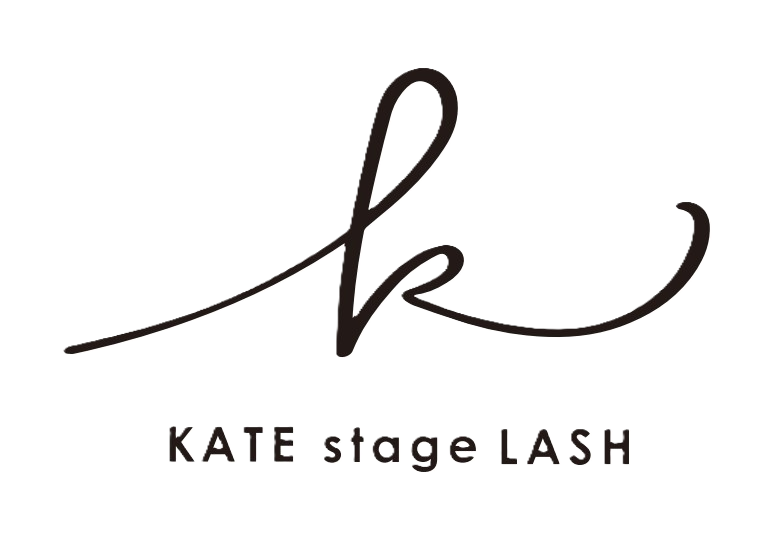

# KATE stage LASH 蒲田西口店 HP
# 画像・動画 設置ガイド（初心者向け）

---

## フォルダ構成

```
KATE-HP/
├── index.html          ← ホームページ本体
├── css/
│   └── style.css       ← デザイン
├── js/
│   └── main.js         ← アニメーション
├── assets/
│   ├── images/         ← 画像をここに入れる
│   └── videos/         ← 動画をここに入れる
└── 画像動画設置ガイド.md  ← このファイル
```

---

## 必須ファイル一覧

### 【最優先】トップページ動画背景

| ファイル名 | 場所 | サイズ目安 | 内容 |
|-----------|------|-----------|------|
| `hero-bg.mp4` | `assets/videos/` | 1920×1080px | トップページ全画面の背景動画 |
| `hero-poster.jpg` | `assets/images/` | 1920×1080px | 動画が読み込まれるまでの静止画 |

**動画の作り方のコツ：**
- 長さ：10〜30秒のループ動画がベスト
- 内容例：施術シーン、まつ毛のアップ、眉毛の仕上がり、サロン内装
- ファイルサイズ：5MB以下推奨（重いとページが遅くなる）
- 音声：なし（ミュート再生されます）

**動画がない場合：**
- `hero-poster.jpg` だけ用意すれば、静止画として表示されます

---

### 【重要】ロゴ・アイコン

| ファイル名 | 場所 | サイズ目安 | 内容 |
|-----------|------|-----------|------|
| `logo.svg` または `logo.png` | `assets/images/` | 横200px程度 | お店のロゴ |
| `favicon.svg` | `assets/images/` | 32×32px | ブラウザタブのアイコン |
| `apple-touch-icon.png` | `assets/images/` | 180×180px | スマホホーム画面アイコン |
| `og-image.jpg` | `assets/images/` | 1200×630px | SNS共有時に表示される画像 |

---

### 【推奨】コンセプトセクション用

| ファイル名 | 場所 | サイズ目安 | 内容 |
|-----------|------|-----------|------|
| `concept-main.jpg` または `concept-main.mp4` | `assets/images/` | 800×600px | 施術シーンのメイン画像 |
| `concept-sub1.jpg` | `assets/images/` | 400×300px | サブ画像1（店内など） |
| `concept-sub2.jpg` | `assets/images/` | 400×300px | サブ画像2（道具など） |

---

### 【推奨】特徴セクション用（5枚）

| ファイル名 | 場所 | 内容 |
|-----------|------|------|
| `feature-golden-ratio.jpg` | `assets/images/` | 黄金比の説明画像 |
| `feature-technique.jpg` | `assets/images/` | 施術技術の画像 |
| `feature-private.jpg` | `assets/images/` | 半個室の画像 |
| `feature-products.jpg` | `assets/images/` | 使用商材の画像 |
| `feature-aftercare.jpg` | `assets/images/` | アフターケアの画像 |

**サイズ：** すべて 600×400px 推奨

---

### 【推奨】メニュー用画像（9枚）

| ファイル名 | 場所 | メニュー名 |
|-----------|------|-----------|
| `menu-parisienne.jpg` | `assets/images/` | パリジェンヌラッシュリフト |
| `menu-lash-perm.jpg` | `assets/images/` | 選べるまつ毛パーマ |
| `menu-eyebrow-wax.jpg` | `assets/images/` | 眉毛アイブロウデザインWAX |
| `menu-hollywood-brow.jpg` | `assets/images/` | ハリウッドブロウリフト |
| `menu-set-parisienne-brow.jpg` | `assets/images/` | パリジェンヌ+眉毛WAX |
| `menu-set-full.jpg` | `assets/images/` | パリジェンヌ×ハリウッド×眉毛 |
| `menu-upper-lower.jpg` | `assets/images/` | 上下まつげパーマ |
| `menu-mens-brow-perm.jpg` | `assets/images/` | メンズ眉毛パーマ |
| `menu-mens-brow-wax.jpg` | `assets/images/` | メンズ眉毛WAX |

**サイズ：** すべて 400×300px 推奨

---

### 【推奨】ビフォーアフター用

| ファイル名 | 場所 | 内容 |
|-----------|------|------|
| `gallery-main.jpg` | `assets/images/` | メインのビフォーアフター画像 |
| `gallery-1.jpg` 〜 `gallery-6.jpg` | `assets/images/` | その他のビフォーアフター |

**サイズ：** 800×600px 推奨

---

### 【推奨】施術の流れ用（4枚）

| ファイル名 | 場所 | 内容 |
|-----------|------|------|
| `flow-step1.jpg` | `assets/images/` | カウンセリング風景 |
| `flow-step2.jpg` | `assets/images/` | デザイン提案風景 |
| `flow-step3.jpg` | `assets/images/` | 施術風景 |
| `flow-step4.jpg` | `assets/images/` | 仕上がり確認風景 |

**サイズ：** 400×300px 推奨

---

## 画像の入れ方（Windows）

### 方法1：エクスプローラーで直接コピー

1. このフォルダを開く：
   ```
   KATE-HP → assets → images
   ```

2. 画像ファイルをドラッグ＆ドロップ

3. ファイル名を上記の名前に変更

### 方法2：スマホの写真を使う場合

1. スマホからPCに写真を送る（LINE、メール、クラウド等）
2. PCに保存
3. ファイル名を変更して `assets/images/` に入れる

---

## 画像の入れ方（Mac）

1. Finderでこのフォルダを開く：
   ```
   KATE-HP → assets → images
   ```

2. 画像ファイルをドラッグ＆ドロップ

3. ファイル名を上記の名前に変更

---

## 動画の入れ方

1. 動画ファイルを用意（MP4形式）
2. `assets/videos/` フォルダに入れる
3. ファイル名を `hero-bg.mp4` に変更

**動画の圧縮方法（重い場合）：**
- 無料サイト：https://www.veed.io/tools/video-compressor
- 目標サイズ：5MB以下

---

## HTMLへの反映方法

画像を入れたら、`index.html` を編集して画像を表示させます。

### 例：ロゴを表示させる

`index.html` の該当部分を探して編集：

**変更前：**
```html
<span class="logo-text">KATE</span>
```

**変更後：**
```html

```

### 例：コンセプト画像を表示させる

**変更前：**
```html
<div class="concept-image-placeholder">
    <span>CONCEPT MOVIE / IMAGE</span>
    <p>施術シーンの動画または写真</p>
</div>
```

**変更後：**
```html

```

---

## 確認方法

1. `index.html` をダブルクリック
2. ブラウザで開かれます
3. 画像が表示されているか確認

---

## よくあるエラーと解決方法

### 画像が表示されない

**原因1：ファイル名が違う**
- 大文字小文字も区別されます
- `Hero-bg.mp4` ではなく `hero-bg.mp4`

**原因2：拡張子が違う**
- `.jpeg` ではなく `.jpg` を使用
- `.PNG` ではなく `.png` を使用

**原因3：フォルダが違う**
- `assets/images/` に入っているか確認

### 動画が再生されない

**原因1：ファイルが重すぎる**
- 10MB以上は圧縮してください

**原因2：形式が違う**
- MP4形式にしてください

---

## 画像がない場合のおすすめ素材サイト

### 無料素材（商用利用可）

1. **Unsplash** - https://unsplash.com/
   - 検索例：「eyelash」「eyebrow」「beauty salon」

2. **Pexels** - https://www.pexels.com/ja-jp/
   - 検索例：「まつ毛」「眉毛」「美容」

3. **Canva** - https://www.canva.com/
   - ロゴやバナーを自分で作れる

---

## 必要最低限で公開する場合

以下の3つだけ用意すれば、ひとまず公開できます：

1. ✅ `hero-poster.jpg` - トップ画像（1920×1080px）
2. ✅ `og-image.jpg` - SNS共有用（1200×630px）
3. ✅ `favicon.svg` または `favicon.png` - タブアイコン（32×32px）

---

## お問い合わせ

ご不明な点があれば、開発者にお気軽にご連絡ください。
